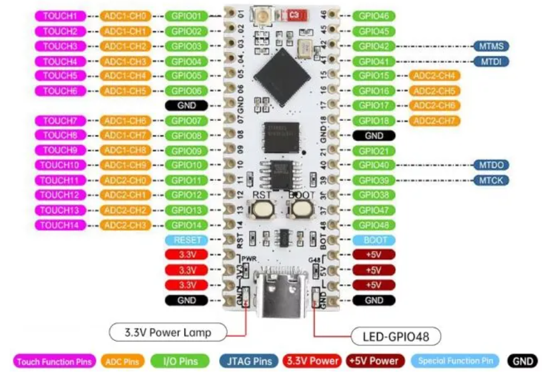

.. _sec-construction-phase:

Konstruktionsphase
##################

Die Position von Servos und die Geschwindigkeit von Motoren wird über deren Eingangsspannung eingestellt. Der ESP32-S3-Nano kann die Spannung eines Ausgangs über eine sogenannte Puls-Weiten-Modulation (PWM) zwischen 0V und 5V variieren. Üblicherweise können bei Mikrocontrollernnicht unbedingt alle Pins eine PWM, einige können nur eingeschaltet (Spannung gleich 5V) oder ausgeschaltet (Spannung gleich 0V) sein. Beim ESP32-S3 können jedoch alle Pins als PWM-Ausgänge verwendet werden, was die Konstruktion des Roboters vereinfacht. Es ist jedoch wichtig zu beachten, dass die maximale Ausgangsspannung der PWM-Pins des ESP32-S3-Nano 3,3V beträgt. Daher müssen die Servos und Motoren, die mit 5V betrieben werden, über einen Pegelwandler oder eine separate Stromversorgung mit 5V versorgt werden, um ordnungsgemäß zu funktionieren.

.. _fig-esp32-s3-nano-pinout:

    ESP32-S3-Nano Pinout
